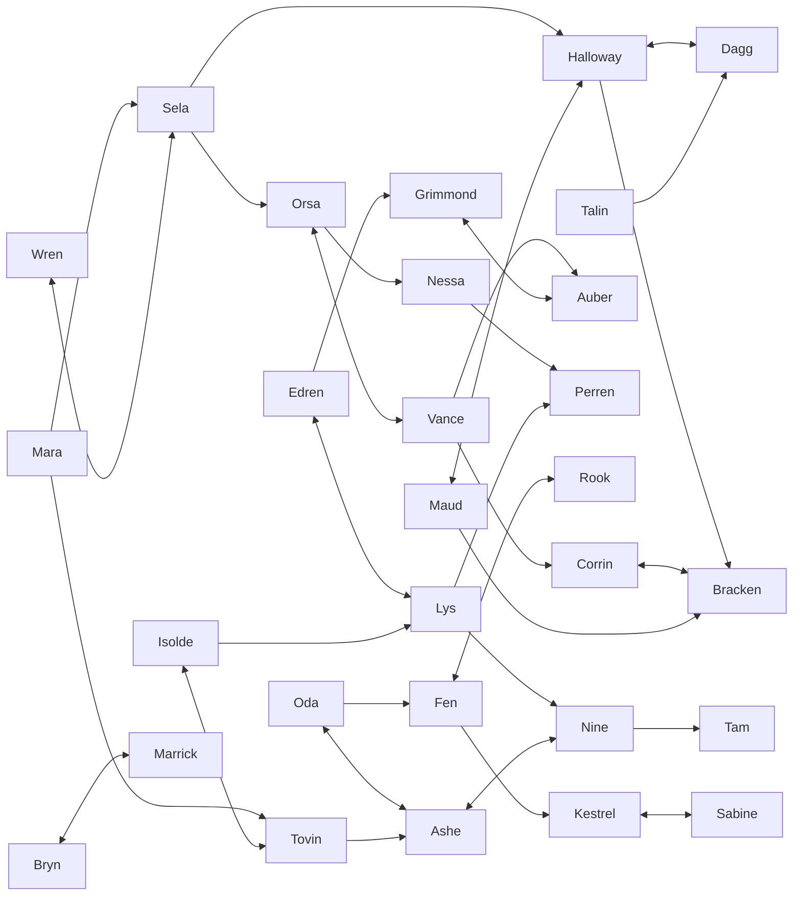

# Full Roster Framework — Initial Core Comparison Model

**Status:** Comprehensive proposal for review; no character finalized  
**Purpose:** Put every traveller into one progression, relationship and reward structure before
detailed prose is approved  
**Composition:** Sabine is the sole Menagerist/Beast-handler; Oda is the channelwright who owns The
Channelworks

This file is a comparison model, not a roster cap. Sabine owns the complete animal-companion system.
Oda’s duplicate Beast-handler role has been replaced with an all-magical-weapons shop. The cast may
continue to grow when another worthwhile person or system calls for it.

## 1. Proposed composition

| Group | Count | Purpose |
|---|---:|---|
| Trade-capable travellers | 18 | Open and deepen the base, making, analysis and long-term world loops |
| Dedicated fighters | 8 | Change party tactics without requiring a building |
| Strange travellers | 4 | Carry story, unusual knowledge and lives not justified by a shop |
| **Snapshot total** | **30** | Current comparison set; the roster is expandable |

“Trade-capable” includes Sela the Wanderer, Tovin the Binder, Sabine the Menagerist/Beast-handler and
Oda the working Spellwright. Their calling
is who they are; owning a progression route does not require renaming them after a shop.

## 2. Authored progression order

This order governs reachability validation, diary-pity direction and content planning. It is **not a
hard recruitment gate**: if the player can write a later signature, that person can still be found.

| # | Traveller | Phase | Conditions | Main payoff | Why here |
|---:|---|---|---:|---|---|
| 1 | **Mara** | Opening | 1 | Survey Post, field instruments | Teaches that people can be deliberately sought and worlds measured |
| 2 | **Edren** | Opening | 2 | Reliquary, sites | Points toward ruins and diary discovery early |
| 3 | **Halloway** | Opening | 2 | Blacksmith | Makes the first material haul useful |
| 4 | **Isolde** | Start of mid | 2 | Scriptorium, pencil, lens | Required hinge; expands what a page can say |
| 5 | **Bryn** | Early–mid | 3 | Protection fighter, back-rank gambit | First dedicated fighter demonstrates party composition |
| 6 | **Orsa** | Early–mid | 3 | Tavern, visitors and clues | Social search support arrives before the cast becomes broad |
| 7 | **Sela** | Mid | 3 | Fieldcraft and organic harvest | First three-condition hunt validates the pencil |
| 8 | **Vance** | Mid | 3 | Exchange and Recycler | Item circulation arrives after the player has accumulated gear |
| 9 | **Talin** | Mid | 3 | Pierce/initiative fighter | First offensive specialist answers plated foes |
| 10 | **Corrin** | Mid | 4 | Tannery, capacity and light protection | Expands hauling as material variety grows |
| 11 | **Nessa** | Mid | 4 | Apothecary and consumables | Adds preparation and the Waystone before the campaign midpoint |
| 12 | **Dagg** | Mid | 4 | Crush/stagger fighter | Contrasts Talin and teaches deliberate slowness |
| 13 | **Rook** | Mid | 4 | Reach/opening fighter | Makes ranks and reach a deliberate party choice |
| 14 | **Lys** | Mid | 4 | Library and cross-reference | Arrives once enough pages exist for archival tools to matter |
| 15 | **Bracken** | Mid | 5 | Armoury and resistance work | Advanced defence after ordinary gear is familiar; role must prove itself |
| 16 | **Fen** | Mid | 5 | Bowyer; all physical ranged weapons | Advanced opening/ranged craft after ordinary forge work |
| 17 | **Maud** | Mid–late | 5–6 | Advanced physical melee weapons | Completes the physical equipment specialisations through fitted melee craft |
| 18 | **Wren** | Mid–late | 5 | Evasion/multi-target fighter | Changes tempo as encounters become denser |
| 19 | **Kestrel** | Mid–late | 5 | Hunter, tracking and butchery | Connects mature bestiary knowledge to the material chain |
| 20 | **Marrick** | Late | 6 | Formation/endurance fighter | Party-wide technique arrives when long fights justify it |
| 21 | **Sabine** | Late | 7 | Menagerie, taming and paired combat | Complete animal system enters as a substantial late-game branch |
| 22 | **Oda** | Late | 7–8 | Channelworks; all magical weapons | Adds magical weapon construction after physical systems are established |
| 23 | **Grimmond** | Late | 7 | Deep Works, hard substrate and deep sites | Opens the deepest material/site layer |
| 24 | **Auber** | Late | 8 | Distillery and advanced essence | Refines a mature essence economy rather than appearing before it exists |
| 25 | **Ashe** | Late | 8 | Elemental fighter | A strange combat answer before the narrative endgame |
| 26 | **Tovin** | Late | 8 proposed | Anchorage and sustain | Permanent worlds become the final major systemic expansion |
| 27 | **Perren** | Late–endgame | 9 | Mirror and Sundering/cult knowledge | Out-of-order diary becomes a major interpretive arc |
| 28 | **Nine** | Endgame | 9 | Dream; continuity through revisable promises | Present identity approved; exact shared-tree lean remains open |
| 29 | **Tam** | Endgame | 10 | Unique capability unresolved | Cannot be finalized until “the one thing” is concrete |
| 30 | **Open in this snapshot** | Endgame | ≤10 | Determined by a human gap | One possible addition, not a final slot or cap |

### Progression pressure to test

- Fourteen travellers still sit between three and five conditions. Their exact order must be made
  visible through diary cross-links and vocabulary acquisition; numbers alone will not pace them.
- Isolde is the only hard-required traveller. No later building should quietly become mandatory
  without receiving the same reachability scrutiny.
- Tovin at #24 means anchoring arrives late. That matches its scale but may postpone the game’s most
  distinctive long-term loop too far; this needs campaign testing, not intuition.

## 3. Structural sheets — trade-capable travellers

These are template summaries. Blank voice, exact signature and prose fields remain deliberately
unfinalized.

| Traveller | Identity premise | Reason to recruit | Contribution | Exclusive teaching | Diary shape | Main unresolved work |
|---|---|---|---|---|---|---|
| **Mara** | Surveyor seeking fixed points | Read worlds and maps better | Survey Post, instruments, mapping | **Scarp** | 6; observation, Sela, landmarks | Current direction; honest replacement clue specified |
| **Edren** | Archaeologist still finding floors | Find and understand sites | Reliquary, site discovery/rewards | **Ruin** | ~7; sites, research, earlier people | Rewrite hard/cold overclaims; define Reliquary |
| **Halloway** | Smith who kept one fire alive | Turn haul into chosen equipment | Blacksmith, reforging, salvage | **Gold ore** | ~6; terse, material, kept fire | Add teaching and relationships |
| **Isolde** | Calligrapher still practising and teaching | Say more on a page | Scriptorium, hands, compounds, lens | **Hush** | ~7; hand, teaching, Tovin | Repair required clues without deadlock |
| **Orsa** | Keeper who makes temporary shelter usable without presuming trust or intimacy | Bring clues and people home | Firepit → Tavern, visitors, wants, rest | **Hive** | 7; convergence, privacy, Sela/Vance/Nine | Identity, diary and Tavern boundary approved |
| **Vance** | Trader who distinguishes circulation, price and worth | Exchange excess and recover materials | Exchange, appraisal, Recycler | **Amber** | 7; provenance, transactions as relationships | Identity and diary direction approved |
| **Sela** | Wanderer who treats destinations with suspicion | Traverse and harvest living worlds better | **Wayfarer's Table**; routes, provisions, organic yield and flora recognition | **Pond** | 7; routes, people, weather | Station fiction and honest clue direction approved |
| **Corrin** | Tanner who works flexible organic material for repeated contact with moving bodies | Carry more and make light protection | Tannery, capacity, bindings, foundational light armour | **Chitin** | 8; provenance, bodies, Bracken/Kestrel | Identity and shop boundary approved |
| **Nessa** | Apothecary who understands effects through substance, dose, body and moment | Prepare, cure and escape | Apothecary, consumables, inks, coatings | **Thorn** | 8; treatment, consent, Auber/Sabine | Identity and earlier placement approved |
| **Bracken** | Armorer concerned with what a body can withstand | Advance armour beyond ordinary forge work | Armoury, higher-tier armour upgrades and recipes, resistance tuning | **Bone** | 7–9; protection, failure, materials | Define the advanced armour recipe families and relationship with the paired Weaponsmith |
| **Fen** | Bowyer who thinks in distance, tension and release | Gain advanced physical ranged options | Bowyer; all non-magical ranged weapon recipes and upgrades | **Silk** | 7–9; distance, creatures/material tension | Define physical ranged families, ammunition assumptions and reach rules |
| **Maud** | Weaponsmith who fits weapons to real bodies and chosen proximity | Gain advanced physical melee options | Weaponsmith; higher-tier non-magical melee recipes and fitted upgrades | **Fitting pattern**; no focus | 8–9; Halloway, fit, responsibility | Identity and non-focus teaching approved |
| **Sabine** | Menagerist/Beast-handler who understands animals socially and in battle | Tame, keep and fight beside animals | Menagerie, trait inspection, commands, paired combat | **Coral** | 9–12; animals, field handling, Kestrel | Create a voice broad enough for care and combat without becoming “animal person” shorthand |
| **Oda** | Channelwright who gives emanation a stable, usable housing | Gain emanation weapons at every reach | Contact, Conduit and Projection housings; heat/caustic/light attunement | **Emanation housing schematic**; no focus | 11–12; containment, Fen, Ashe | System direction approved; numbers and names remain placeholders |
| **Grimmond** | Delver who reads the load, flow and void left by extraction | Reach hard/deep materials and sites | Deep Works, extraction, deep locations | **Mercury** | 11; depth, scarcity, Edren/Auber | Identity and extraction boundary approved |
| **Auber** | Distiller who separates a thing from what carries it without calling the remainder nothing | Crystallise, attune and infuse essence using world resources | Distillery; advanced essence items/modifications, not a new wallet | **Brine** | 12; processes, Nessa, Grimmond, Oda/Tovin | Identity/system approved; exact recipes remain later work |
| **Lys** | Archivist who preserves contradiction and relationships between fragments | Make the growing page corpus legible | Library, hints, study, cross-reference | **Echo** | 9; conflicting accounts and editorial consequence | Identity and diary direction approved |
| **Tovin** | Binder who knows that understanding a cost does not prevent paying it | Keep worlds and understand their failure | Anchorage, tethers, sustain, assignments | **Drift** | >10; 8 location + lost worlds + cast links | Signature expansion, anchoring decision, replace placeholder focus |

## 4. Structural sheets — dedicated fighters

| Traveller | Identity premise needed | Reason to recruit | Exclusive contribution | Diary shape | Main unresolved work |
|---|---|---|---|---|---|
| **Bryn** | Warden who intervenes without treating protection as ownership or debt | Stabilise fragile formations | Back-rank ally gambit; Draw Off; Protection lean | 7; consent, intervention, Marrick/Ashe | Identity and diary direction approved |
| **Talin** | Decisive fighter who accepts responsibility before certainty arrives | Answer plated foes quickly | Armour-threshold gambit; Pierce/initiative lean | 7; openings, decisions and revised judgement | Identity and diary direction approved |
| **Dagg** | Hammer fighter who understands force as footing, commitment and recovery | Crush, stagger and exploit slow turns | Recovery gambit TBD with active skills; Force lean | 8; recovery, patience, Halloway/Talin | Identity approved; exact teaching deliberately held |
| **Rook** | Spear fighter who makes approach, warning and consequence legible | Control the opening exchange and ranks | **Foe: cannot reach me** gambit; reach technique | 8; boundaries, Fen, formations | Identity and diary direction approved |
| **Wren** | Skirmisher who treats burst tempo as debt and movement as preserving options | Handle swarms and gain tempo | Foes-present gambit; Quicken; Evasion lean | 9; crowds, exits, Sela/Dagg | Identity and diary direction approved |
| **Kestrel** | Hunter and field naturalist who separates evidence from entitlement | Track threats and improve informed butchery | **Foe: unrecorded species** gambit; tracking | 9; bestiary, Sabine, material ethics | Identity direction approved |
| **Marrick** | Formation leader who builds shared routines usable under fear and fatigue | Sustain and coordinate long fights | Any-ally low-HP gambit; party buffs | 10; groups, Bryn, a formation that excluded | Identity and diary direction approved |
| **Ashe** | Emanant whose body carries and expresses thermal emanation | Answer elemental and warded foes | **Foe: emanating** gambit; Ground technique TBD | 12; bodily autonomy, Oda/Tovin/Nine | Identity direction and name approved |

Fighters should teach gambit components or techniques by default. Giving Kestrel or Ashe a precise
world focus is valid only if it is more central to them than their combat knowledge and does not
duplicate a trade traveller.

## 5. Structural sheets — strange travellers

| Traveller | Identity premise | Reason to recruit | Contribution | Diary shape | Readiness |
|---|---|---|---|---|---|
| **Perren** | Former cult author who recognises instructions designed to make obedience feel discovered | Understand coercive framing and a dangerous part of the past | **Mirror**; cult/Sundering interpretation; shared-tree growth | 12; out-of-order ideological turn | Present identity and cult premise approved |
| **Nine** | Builds continuity through verifiable practices and revisable promises after autobiographical memory | Gain Dream and a late companion valuable in the present | **Dream**; shared-tree growth; no memory subsystem | 13; chosen repetition, present relationships | Present identity approved |
| **Tam** | Ordinary worker changed into the only person able to perform one endgame act | Blocked until that act belongs to a settled system | Glass not reserved; contribution held | 12+ eventually; ordinary work must remain central | Formally hold until anchoring/Great Work/reset/Glass decisions |
| **Open in this snapshot** | Determined after the relationship graph exposes a missing human shape | TBD | TBD | TBD | Intentionally blank; additional travellers remain possible |

## 6. Teaching ledger

| Traveller | Teaching | State |
|---|---|---|
| Mara | **Scarp** | Current placeholder; avoids adding Bluff synonym |
| Edren | Ruin | Proposed, distinct |
| Halloway | Gold ore | Proposed, distinct |
| Isolde | Hush | Current design decision |
| Orsa | **Hive** | Approved, diary-exclusive |
| Vance | **Amber** | Approved, diary-exclusive |
| Sela | Pond | Proposed, distinct |
| Corrin | **Chitin** | Approved, diary-exclusive |
| Nessa | **Thorn** | Approved, diary-exclusive |
| Bracken | Bone | Proposed, distinct |
| Fen | Silk | Proposed, distinct |
| Maud | **Fitting pattern** | Approved non-focus recipe/research teaching |
| Sabine | **Coral** | Approved, diary-exclusive |
| Oda | **Emanation housing schematic** | Approved non-focus teaching; Arc retired |
| Grimmond | **Mercury** | Approved, diary-exclusive |
| Auber | **Brine** | Approved, diary-exclusive replacement for duplicated Amber |
| Lys | **Echo** | Approved, diary-exclusive |
| Tovin | Drift | Current roster decision; live data conflicts |
| Fighters | Gambit component or technique | Preferred; exact ledger incomplete |
| Ashe | **Foe: emanating** gambit | Approved; Ground technique still needs combat design |
| Perren | **Mirror** | Approved, diary-exclusive |
| Nine | **Dream** | Approved, diary-exclusive |
| Tam | None reserved | Held until endgame capability and Glass decision are settled |
| Open/additional | TBD | Intentionally expandable |

## 7. Relationship graph

This is a proposal for diary and meeting development, not a demand that every relationship be
friendly or equally prominent.

### Relationship rules

- Each traveller should ultimately participate in at least two meaningful connections, but the
  graph may be uneven; central social people should connect more widely.
- At least one connection should help the search loop through whereabouts, interpretation or clue
  redundancy.
- At least one should reveal character rather than merely route progression.
- Open and future travellers remain outside the graph until we see which people are isolated or
  which kinds of relationship are missing.
- Tam currently has only Nine because Tam’s actual contribution is undefined. That is evidence of
  incompleteness, not a relationship decision.

## 8. Diary distribution framework

Exact counts come after signatures and relationships, but the roster needs different book shapes.

| Diary shape | Likely travellers | Emphasis |
|---|---|---|
| **Observational** | Mara, Sela, Kestrel | Worlds, routes, species, people seen at a distance |
| **Material/process** | Halloway, Corrin, Nessa, Bracken, Fen, Grimmond, Auber | Sites, research, transformations, failures of craft |
| **Social/networked** | Orsa, Vance, Lys | Whereabouts, exchanges, conflicting accounts, other diaries |
| **Instructional** | Isolde, Tovin, Sabine, Oda, fighters | Runes, techniques, gambits, practices—still in personal voice |
| **Fragmented/reversal** | Perren, Nine, Tam, Ashe | Out-of-order meaning, identity, bodily or historical change |

Every diary may use every valid page kind. The shapes prevent “5–10 assorted pages” from becoming
the same recipe repeated across the cast.

## 9. Full-matrix findings

### Structurally ready for detailed sheets

The implemented six, Orsa, Corrin, Nessa, Grimmond, Lys, Bryn, Wren, Kestrel and Perren. Their exact
writing is absent, but their role in the game is clear enough to develop.

### Need one role decision before detailed writing

- **Bracken:** advanced armour recipe families and tier structure; the Armoury itself is approved.
- **Fen:** physical ranged weapon families and reach/ammunition rules.
- **Maud / Weaponsmith:** identity and name are approved; teaching stays open.
- **Oda:** define the ranged-magic weapon system, workshop and human premise.
- **Auber:** identity and Distillery direction approved; exact operations require a later recipe pass.
- **Talin, Dagg, Rook and Marrick:** sharper personal premises.

### Not ready to finalize

- **Nine:** present-day contribution.
- **Tam:** unique capability and Glass dependency.
- **Open/additional travellers:** intentionally unwritten.

## 10. Next review batches

### Batch A — composition and base ownership

1. **Settled:** Sabine alone owns the Menagerist/Beast-handler role; Oda owns all magical weapon
   craft instead.
2. **Settled:** Bracken’s Armoury provides higher-tier armour upgrades and recipes.
3. **Settled:** Fen owns all non-magical ranged weapon craft; a separate new traveller owns advanced
   non-magical melee weapon craft through the Weaponsmith.
4. Auber and the Distillery now have a developed proposal in `traveller-identity-auber-distillery.md`:
   crystallise, attune and infuse without adding wallet currencies.

### Batch B — teachings

1. **Settled:** Echo belongs to Lys; Ashe teaches `Foe: emanating` and has a thermal Ground technique
   still requiring combat design.
2. **Settled:** Auber receives diary-exclusive Brine, Vance receives diary-exclusive Amber, and
   Kestrel teaches `Foe: unrecorded species`.
3. Confirm the remaining unique teaching ledger as the basis for signature/vocabulary order.

### Batch C — human premises

Talin, Dagg, Rook, Marrick, Ashe, Perren and Nine now have approved present identities. Tam is
formally held until the endgame systems that could justify their unique act are settled.

Sabine and Oda now have developed identity proposals, meeting directions, diary arcs, signature
concepts and relationship hooks in `traveller-identities-sabine-oda.md`.

Bracken, Fen and Maud now have developed identity proposals, meeting directions, diary arcs,
signature concepts and relationship hooks in `traveller-identities-equipment-specialists.md`.

### Batch D — order and relationships

Review the current core sequence, especially Nessa’s timing and whether Tovin at #25 makes anchoring
arrive too late. New travellers can be inserted without displacing anyone. Then revise the
relationship graph before drafting page lists.
